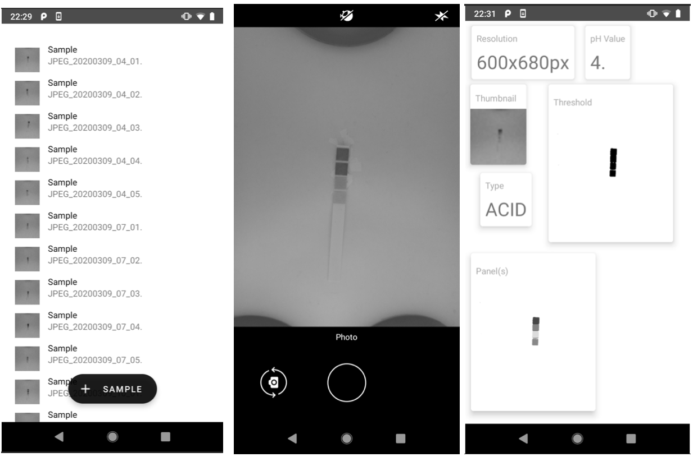

# final-year-project

Student: Ultan Ó Móráin

The public facing repository for my final year project submitted in partial 
fulfilment of the requirements for the degree of B.A. (Mod.) Computer Science. 

**code/** 

Contains the code for the Android application. To run the application using 
Android Studio, ensure your hardware is supported and give the application 
permission to access the camera. Select an example image from data-set/ 
and preload it into the applications local storage. A suitable example image 
is data-set/dipped/JPEG_20200309_04_02.jpg. Once this is done, run the application. 
If difficulties are encountered, refer to the 
[Android Developer Website](https://developer.android.com).

**data-set/**

The data set created and used for this project. This includes images of colour
charts (both with and without flash), not dipped test strips (both with and
without flash) and dipped test strips used on a variety of solutions.

**report-presentation/**

The report and presentation in PDF format. Both were written in Latex using
Overleaf. The report is an extension of the template provided by the School. 

**scripts/**

Data analysis scripts used for exploring the data. Also used for generating plots
for the report.  

**segmentation-results/**

Results of image segmentation. 

**screenshots/**

